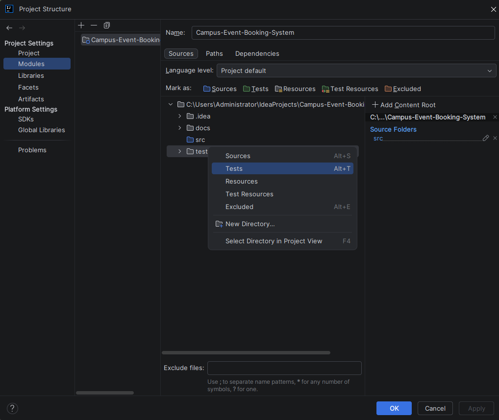
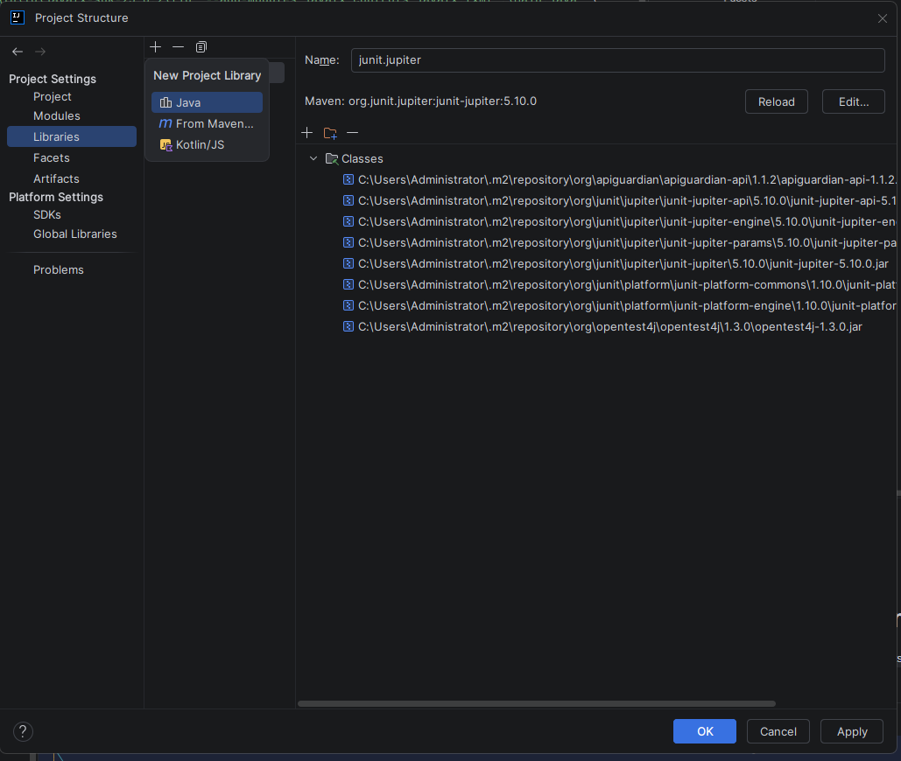
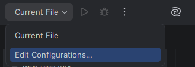
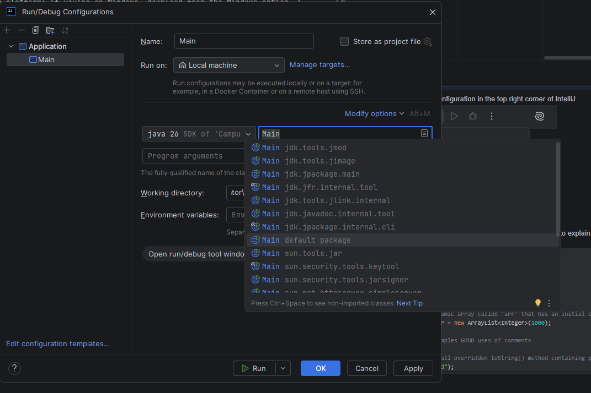

# Campus Event Booking System
This project is a campus event booking system written in Java, which uses CSV files to store the data.

# Naming Conventions/Style Guide
Below is the style guide/conventions to use during development:
- Use `snake_case` for variable/function names.
- **Use `camelCase` for all getters/setters, since JavaFX's PropertyValueFactory method requires it.**
- Use `TitleCase` for class/enum names and **enum values**.

# How To Add Tests (JUnit)
Make sure you have added JUnit to your local build dependencies. [Follow JetBrains's Guide here](https://www.jetbrains.com/help/idea/junit.html#intellij). Once you have to enter a JUnit version, specify `5.12.2`. From there, you can hit Alt+Enter on any class to generate tests for their methods.

# Build/Run Instructions
These instructions are made assuming that you are using IntelliJ IDEA. \
If you are a CLI user, this is a command which should run the main app (just make sure to replace C:\PATH\TO with the appropriate path) \
`java --module-path "C:\PATH\TO\javafx-sdk-25.0.2\lib" --add-modules javafx.controls,javafx.fxml .\Main.java` \
Step-by-step, here's how you build on IntelliJ.
## Prerequisites
The only thing requiring manual installation is OpenJFX, which can be acquired from [Oracle directly](https://www.oracle.com/java/technologies/downloads/javafx/#javafx26-linux).\
Choose your JavaFX package based on your platform; if you're on Windows, download from the Windows option. \
Extract the zip file you downloaded to any location on your disk, just make sure to save the path to it, it's going to be important later. \
## Configuring Project Settings
1) Press Ctrl + Shift + Alt + S to open the Project Settings menu
2) In this menu, the first thing we want to look at is "SDK Version", which will either already have a version in it, or will be red. \
If it is red, as in the screenshot, you can click "Download", and fetch the latest JDK version. \

3) Add tests folder as "Tests", and src folder as "Sources" in "Modules" submenu \

4) Add your JavaFX lib to the libraries option as depicted below, **MAKE SURE IT IS THE /LIB FOLDER WITHIN JAVAFX**\

5) Create a new app configuration in the top right corner of IntelliJ \

6) Create it using the template `Application`, and name it as you see fit. The main class should be `Main` of `default package`.

7) Once you're in that menu, press Alt +V, and add the following (replace the path with your local path) \
`--module-path "C:\PATH\TO\javafx-sdk-25.0.2\lib" --add-modules javafx.controls,javafx.fxml`
## You're all set! You can now run the program.
# A Note About Comments
Code should be self-documenting. Comments should be used to explain oddities/"quirks" of the specific function/class/method. See below for an example.
```java
// Below are some examples of BAD uses of comments
// The function foo(), when called, returns the number 1
void foo() {
    return 1;
}

// This creates a dynamic array called 'arr' that has an initial capacity of 1000 entries
ArrayList<Integer> arr = new ArrayList<Integer>(1000);

// Below are some examples GOOD uses of comments

// Constructor will call overridden toString() method containing passed parameters
Object("hello". "world");
```

Comments are here to make abstraction clearer to someone that doesn't know the underlying implementation for some code.